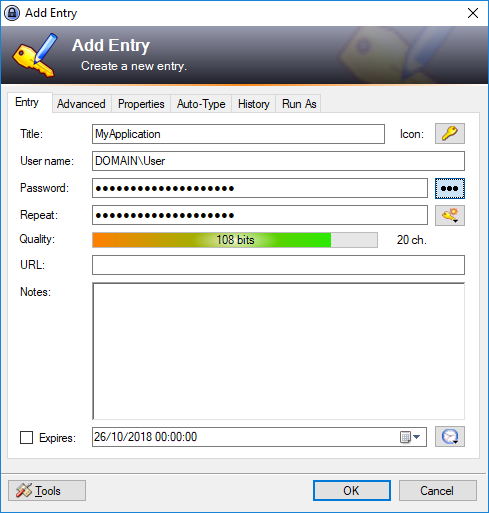
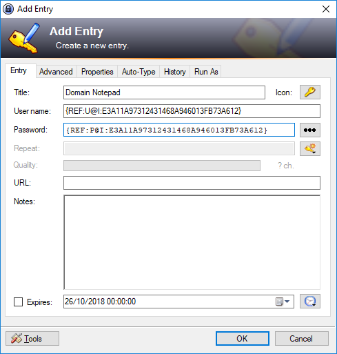

# Setup: Entry Per Application #

At the time of writing, this is the only way to configure the plugin but I plan to introduce simpler setup methods.

In order to configure the plugin, we will configure one entry per application we wish to launch. This will start with a basic setup, we will then look at sharing credentials between entries.

## Creating an Impersonation Entry ##

An entry configured for impersonation is the same as any other password entry except for a few additional fields.

1. To begin, create a new password entry complete with username and password. If you are connecting using a domain account be sure to include the domain name. You can do this in either the `DOMAIN\User` or `User@DOMAIN` format.

   

2. Then move to the Run As tab. Enable the run as options and browse for the application you wish to launch. If the credentials you are going to run as do not exist on your local machine, check the "Use Credentials for Network Only" option.

   

3. (Optional) You can make the entry more recognisable by clicking the "Set Entry Icon from Application" button.
4. Click save to store the changes.

The impersonation settings will be saved in the string fields for the password entry. This can be seen in the "Advanced" tab of the password entry dialog but it is best not to change these directly as it could break the plugin functionality.

To run the application, right click the entry and select "Run Application as User" or highlight the entry and press `Ctrl+G` :

**Tip:** If you click the menu item or press the shortcut key when multiple items selected, they will all be launched.

## Sharing Credentials ##

This is a feature of KeePass rather than the plugin but it can be a bit tricky to set up so we will cover it here.

1. Make sure you have an entry configured with your credentials stored. As with the previous section, this must have the username in the format `DOMAIN\User` or `User@DOMAIN` if you are connecting to a domain.
2. Create another entry to use for the application but do not fill out the username and password. Instead, select "Tools" at the bottom of the password entry dialog and then "Insert Field Reference" and "In User Name Field".

   

3. Select the entry which you wish to use the credentials from. Ensure the "Source field to reference" is set to "User name". For "Identify source entry by" you will need to select a suitable way for the application to locate the reference. UUID is best but not very readable. Title is very readable but means you cannot have multiple entries with the same title and it will break if you rename the credential entry. Once you are done, click "OK".

   

4. Repeat step 3 for the password field or copy the contents of the "User name" field into the password field and change `REF:U` to `REF:P`. You should have something looking like below:

   

5. Configure the "Run As" tab as per the instructions above.

This entry should now work as before but will load it's credentials from the shared entry. This means that when your domain password expires, you only need to update it in one place.