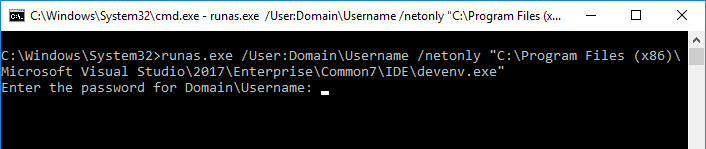

# The VPN Problem #

I am the developer of the KeePass Impersonation Plugin and use it almost every workday for connecting to a VPN.

I connect to an corporate network over a VPN from a machine which is not part of the same domain. The usual workaround to the problem of authentication is to make sure your username and password match. Windows will then successfully map the credentials. Unfortunately this is not an option for me.

For a long time, I ended up using the `/netonly` flag on the runas command:

```cmd
runas.exe /User:<Domain>\<Username> /netonly "C:\Program Files (x86)\Microsoft Visual Studio\2017\Enterprise\Common7\IDE\devenv.exe"
```

Although this works, it is rather annoying to use with a password manager as it will ask for a password on the command line:



To paste to the command line before Windows 10, you have to right click the title bar, go to the edit menu and select paste. I believe you can also right click in the Window to paste but this sometimes pastes the contents twice. In Windows 10, you can press `Ctrl+V`, but again, this is not reliable. On top of this, as the password prompt doesn't show your input (a sensible security feature), you can't tell what has been pasted. As an added bonus, because of the `/netonly` flag, the credentials cannot be checked until you connect to something using them. This means that the application will launch even if the password is wrong.

I tried a number of alternatives. For a while I had a [URL Override](https://keepass.info/help/base/autourl.html#override) configured but this couldn't pass the password and autotype sometimes changed to the wrong window.

I wanted something better.